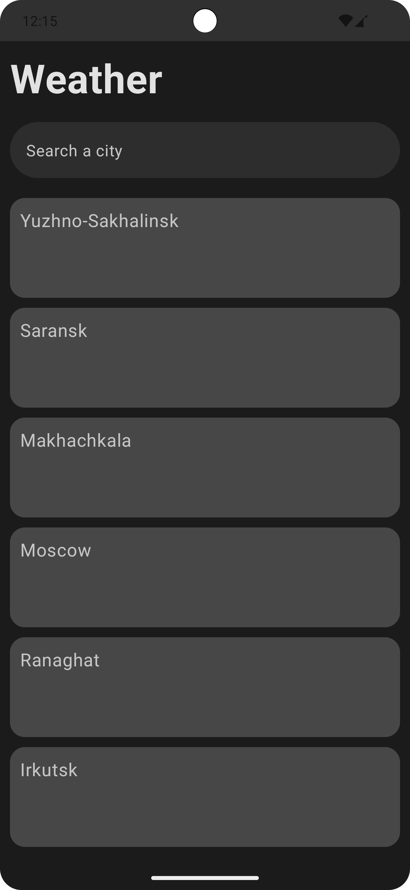
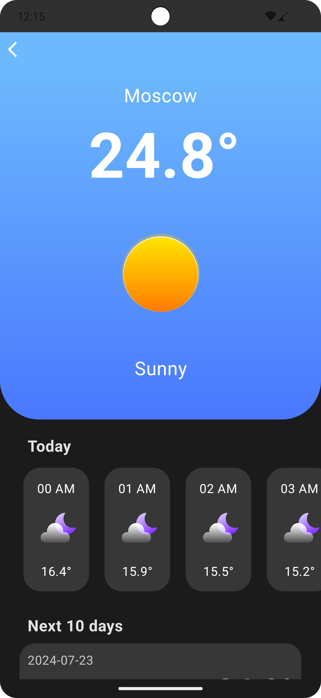
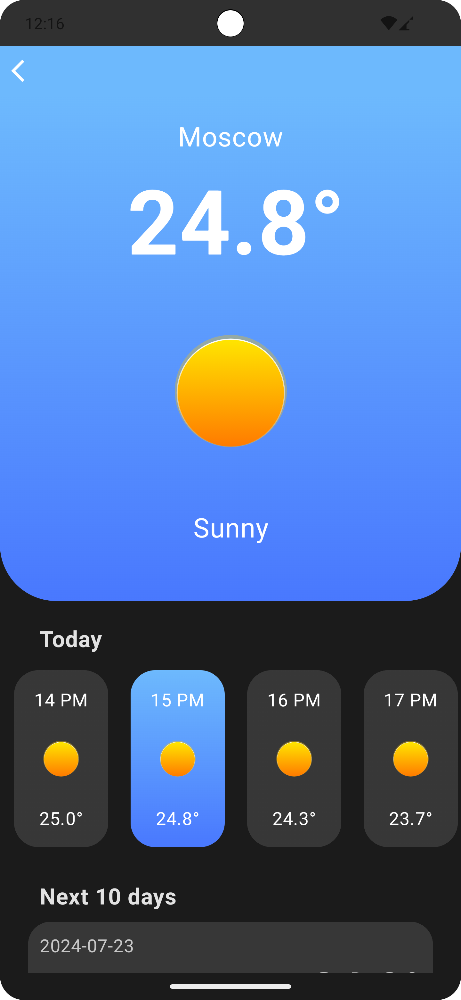
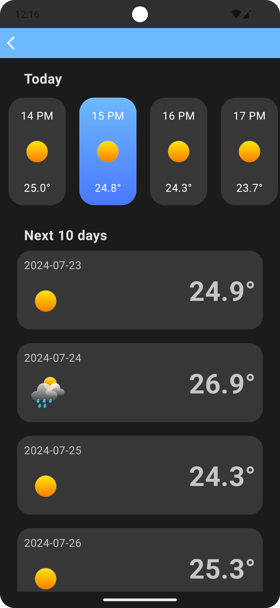
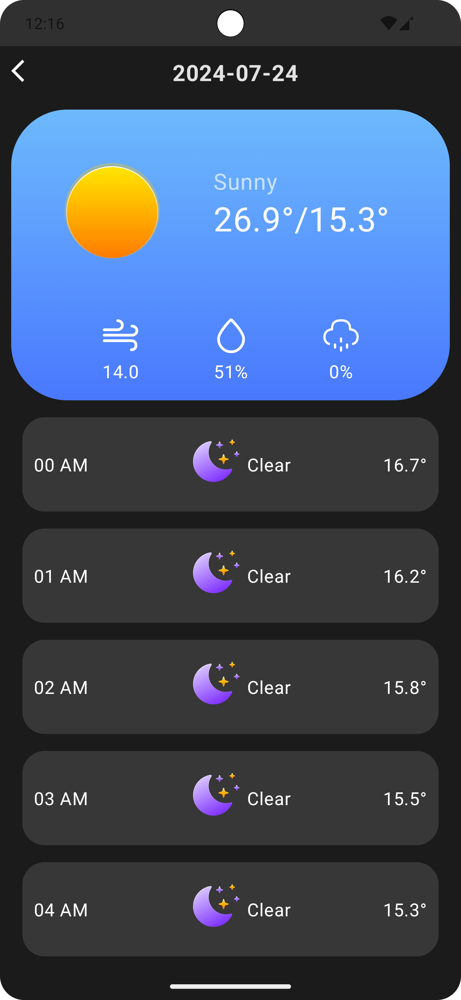

<h1>Weather Application</h1>

Приложение, которое позволяет посмотреть прогноз погоды

<h1>Скриншоты</h1>

  
  
  
  
  

## Stack
### Architecture

- Clean architecture
- MVVM
- Modules

### UI
- Jetpack Compose
- Jetpack Navigation

### DI
- Dagger 2

### Asynchrony
- Coroutines
- Flow

### Database
- Room

### Network
- Firebase
- Retrofit
- Coil
